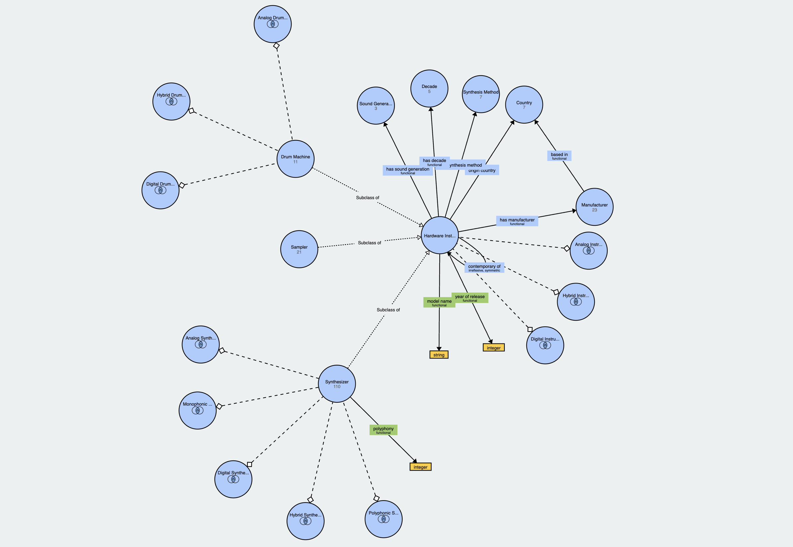

# Electronic Music Instrument Ontology

An OWL2 ontology of hardware electronic music instruments: synthesizers, samplers and drum machines from the 1970s onwards. It models manufacturer, country, year of release, sound generation paradigm (analog, digital, hybrid) and synthesis method as separate properties, with defined classes, inferred properties and SWRL rules for classification by decade.

Full write-up: [docs/Ontology_Report.pdf](docs/Ontology_Report.pdf).



## Overview

- 142 manually verified instruments from 23 manufacturers (CSV pipeline), or 371 unverified instances populated live from DBpedia (SPARQL pipeline). Both share the same T-Box.
- Reasoning with **Pellet** (needed for the SWRL numeric built-ins).
- A companion `query.py` runs seven competency queries over the inferred structure.

## Data sources

- Vintage Synth Explorer (https://vintagesynth.com): synth list
- DBpedia (https://dbpedia.org/sparql): structured infobox data
- Wikidata (https://www.wikidata.org): Q-numbers for `skos:exactMatch` links
- Manual annotation: for cleaning DBpedia errors in the curated CSV

## Structure

There are two ways to populate the ontology, each in its own folder:

- `populate_from_CSV/` reads from a hand-cleaned CSV. Fast and small.
- `populate_from_SPARQL_Alternative/` queries DBpedia at runtime. Slower but covers more synths.

`Scrape_&_DBMatch_Scripts/` contains the scripts used to build the verified CSV in the first place (scraping VSE, checking DBpedia coverage). The scraper also needs `requests` and `beautifulsoup4`.

## Quick start

Install the dependencies:

```bash
pip3 install -r requirements.txt
```

### CSV pipeline

```bash
cd populate_from_CSV
python3 populate.py
python3 query.py
```

Takes a few seconds. Writes/overwrites `electronic_music_instruments.owl`.

### SPARQL pipeline

```bash
cd populate_from_SPARQL_Alternative
python3 populate_from_SPARQL_endpoint.py
python3 query.py
```

**Warning:** this one takes about 25 minutes because it sends one SPARQL query to DBpedia for each of the 377 synths in the seed list. The output is written to `electronic_music_instruments_from_sparql.owl`.

## Reasoner and SWRL rules

Open whichever .owl file you want to inspect in Protégé and start the **Pellet** reasoner (HermiT doesn't support the SWRL built-in atoms used here). The SWRL rules below are already saved inside the .owl file; they classify each instrument into a decade based on its release year:

    HardwareInstrument(?x) ^ yearOfRelease(?x, ?y)
        ^ swrlb:greaterThanOrEqual(?y, 1980) ^ swrlb:lessThan(?y, 1990)
        -> hasDecade(?x, Eighties)

The same pattern is used for the Seventies, Nineties, TwoThousands and TwoThousandTens classes.

## Adding new synthesizers

Edit `populate_from_CSV/abox_candidates_verified.csv` and re-run `populate.py`. The columns are pretty self-explanatory. If the manufacturer is new, also add it to the `MANUFACTURER_COUNTRY` dictionary at the top of `populate.py`.
